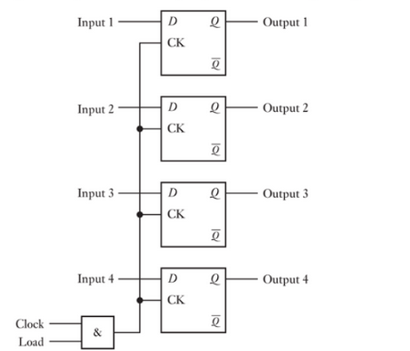
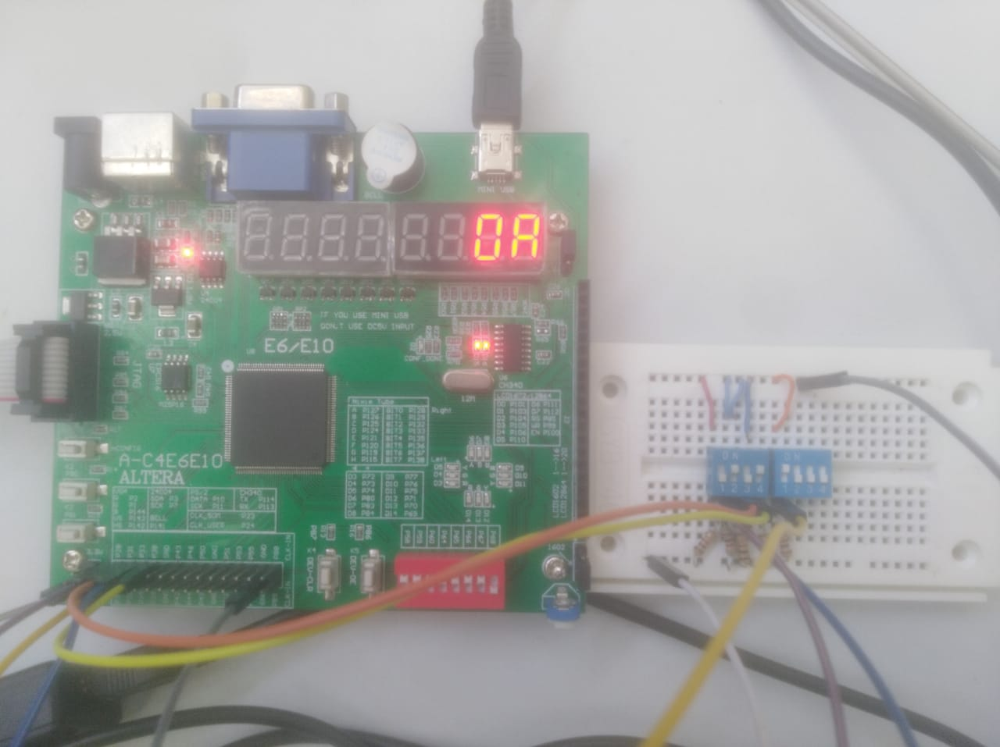
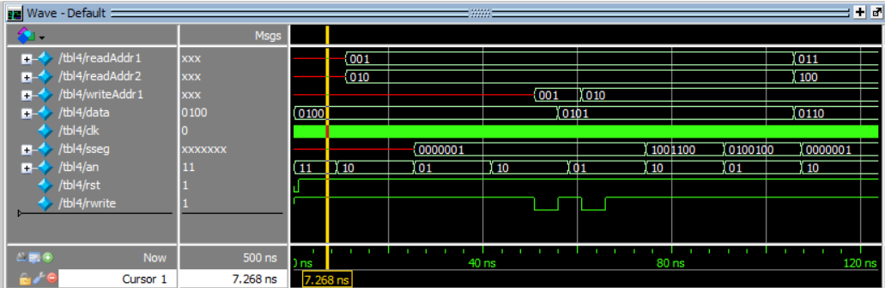
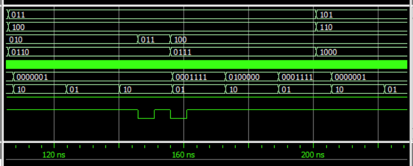
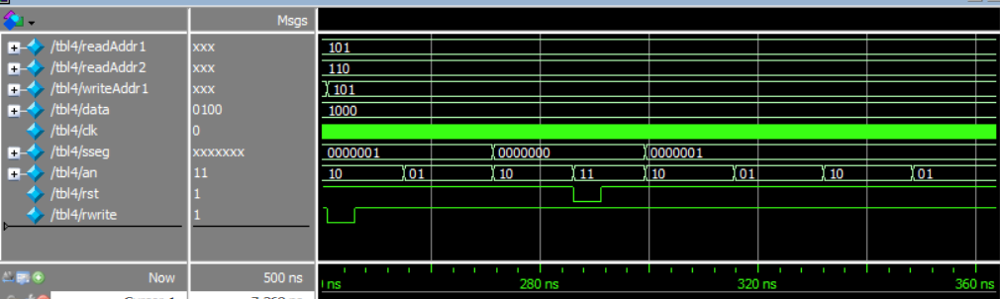

# lab04 - Banco de Registro

## Nombres de integrantes

### Diddier Alexander Hilarion Beltran
### Gabriela María Castro Beltrán
### Daniel Pineda

## Resumen 
En el presente informe, se muestra la realización del diseño, sintentización e implementación de un banco de registro, el cual fue necesario un divisor de frecuencia para la visualización en el display de siete segmentos con su respectivo multiplexor de binario a BCD, además se tienen los siguiente requerimientos para el banco de registro: tener 8 registros de cuatro bits por medio de interruptores, tener la capacidad de lectura simultanea de 2 registros, la capacidad de escritura por medio de una señal de control y un botón de reset. Este laboratorio se efectuó através de Quartus, una herramienta de software producida por Altera para el análisis y la síntesis de diseños realizados en HDL o hardware description lenguage por sus siglas en inglés.

## Palabras claves
Verilog, tablas de verdad, compuertas lógicas, bit, FPGA, BCD, memoria, dirreción, registro 

## Introducción

### Flip-flop
Los bloques básicos para construir los circuitos lógicos secuenciales son los flip-flops, caracterizados por su capacidad de memoria. Los flip-flops tambipen denominados como cerrojos, estos estan inicialmente construidos a partir de compuertas lógicas o en su forma de circuito integrado. Los flip-flops son importantes para el almacenamientos de datos, generación de tiempos, contadores que sigan una secuencia lógica, siendo dispositivos síncronos de dos estados, lo cual significa que la salida cambia de estado por medio de un disparo de un reloj (clock), en ellos es posible almacenar un único bit de datos (0 o 1). Existen diferentes tipos de flip-flops, entre los más importantes estan flip-flop RS, JK, D Y T.

### Banco de registro
En este aplicamos lo visto anteriormente para guradar un dato con flip-flop, en los cuales tendremos que almacenar cada bit del dato, dando como resultado un registro de dicho dato, hasta que se actualize el valor por medio de otro contralador que reescribe el valor nuevo y lo vuelve a almacenar. Esta es basicamente la lógica que sigue un banco de registro el cual guarda una información por un tiempo determinado y pasando dicho tiempo actualiza y vuelve a guardar el nuevo valor dado. Un banco de registro es una serie de posiciones de memoria de registros en forma de matriz, los cuales se pueden acceder por medio de una dirección, que permiten un acceso a operandos y lugares de almacenamiento, dando resultados mucho más veloces que si estuvieran en el sistema de memoria normal, estas operaciones se conocen como lectura y escritura de datos.




## Montaje
Se implementó el banco de registro usando 3 dip switches para la dirección de escritura, 6 dip switches para las direcciones de lectura y dos display 7 segmentos incluidos en la placa de desarrollo.



En el siguiente video se observan las operaciones de lectura de varios registros y la operación de reset.

[](https://www.youtube.com/embed/rSXjIcVdfA4 "Lectura")

En el siguiente video se observa la operación de escritura en el mismo registro que se está leyendo.

[](https://www.youtube.com/embed/idSq0Th2FWU "Escritura")


## Análisis del código

A continuación se encontrara el código que cada módulo que se utilizó, junto con su explicación.
### Módulo de display:

En este módulo recibe el número el cual se deasea visualizar, la señal del clock y la señal del reset. Como salida tiene el ánodo a seleccionar y la decodificación del siete segmentos. En este módulo se instancian los demás módulos y los cables que los concectan.

```python
`timescale 1ns / 1ps
module display(
	input[2:0] readAddr1,
	input[2:0] readAddr2,
	input[2:0] writeAddr1,
	input[3:0] data,
	input clk,
	output [0:6] sseg,
	output [1:0] an,
	input rst,
	input rwrite
);

wire [4:0] bcd;
//modulo que convierte bcd a 7seg
BCDtoSSeg bcdsseg(.BCD(bcd), .SSeg(sseg));

//módulo divisor de frecuencia
//módule counter_clk(input clk, input rst, output reg [26:0] cfreq);
wire [26:0] cf;
counter_clk(.clk(clk), .rst(rst), .cfreq(cf));

//módulo para la visualizacion dinamica
wire [3:0] o1;
wire [3:0] o2;
dynamic_v dv(.rst(rst), .clk_e(clk), .out1(o1), .out2(o2), .an(an), .bcd(bcd) );

//módulo para el de banco de registro
BancoRegistro br(.addrRa(readAddr1), .addrRb(readAddr2), .datOutRa(o1), .datOutRb(o2), 
.addrW(writeAddr1), .datW(data), .RegWrite(rwrite), .rst(rst));

endmodule
```


### Módulo dinamic_v:

Este módulo recibe la señal del clock enable (a la frecuencia de 16 ms) y el número a visualizar. Como salida se obtiene la codificación del número en BCD y el ánodo al que corresponde cada caso. Este modulo se encarga principalmente de la codificación del número recibido y hacer la multiplexación para el anodo. 

```python
module dynamic_v(input rst,
 input clk_e, input [3:0] out1, input [3:0] out2, output reg [1:0] an,
 output reg [3:0] bcd);

reg count =0;
always @(posedge clk_e) begin
		if(rst==0) begin
			count<= 0;
			an<=2'b11; 
		end else begin 
			count<= count+1;
			an<=2'b10; 
			case (count) 
				1'h0: begin bcd <= out1;   an<=2'b10; end 
				1'h1: begin bcd <= out2;   an<=2'b01; end
			endcase
		end
end


endmodule
```

### Módulo counter_clk:

Este módulo recibe la señal de clock y la señal de reset y como salida se obtiene un registro contador. En este módulo se cuentan los flancos de subida del clock para hacer despues la división de frecuencia para la señal enable.

```python
module counter_clk(input clk, input rst, output reg [26:0] cfreq);

always @(posedge clk) begin//cuenta los ciclos de reloj
  if(rst==1) begin
		cfreq <= 0;
	end else begin
		cfreq <=cfreq+1;
	end
end

endmodule
```

### Módulo BCDtoSSeg:

Este módulo recibe la codificación del número en BCD y como salida da la codificación del número para el display 7 segmentos. Es un módulo base para toda la visualización.

```python
module BCDtoSSeg(input [3:0] BCD, output reg[6:0] Seg);


always @ (*) begin 

	case (BCD) 
	//                abcdefg
	4'b0000: Seg = 7'b0000001; // "0"  
	4'b0001: Seg = 7'b1001111; // "1" 
	4'b0010: Seg = 7'b0010010; // "2" 
	4'b0011: Seg = 7'b0000110; // "3" 
	4'b0100: Seg = 7'b1001100; // "4" 
	4'b0101: Seg = 7'b0100100; // "5" 
	4'b0110: Seg = 7'b0100000; // "6" 
	4'b0111: Seg = 7'b0001111; // "7" 
	4'b1000: Seg = 7'b0000000; // "8"  
	4'b1001: Seg = 7'b0000100; // "9" 
	4'ha:     Seg = 7'b0001000; // "A"
	4'hb:     Seg = 7'b1100000; // "B"
	4'hc:     Seg = 7'b0110001; // "C"
	4'hd:     Seg = 7'b1000010; // "D"
	4'he:     Seg = 7'b0110000; // "E"
	4'hf:     Seg = 7'b0111000; // "F"
	default:  Seg = 7'b0000000; //off
	endcase
	end
endmodule

```
### Módulo del Banco de registro

```python
`timescale 1ns / 1ps

module BancoRegistro #(      		 //   #( Parametros
         parameter BIT_ADDR = 3,  //   BIT_ADDR Número de bit para la dirección
         parameter BIT_DATO = 4  //  BIT_DATO  Número de bit para el dato
	)
	(
    input [BIT_ADDR-1:0] addrRa,
    input [BIT_ADDR-1:0] addrRb,
    
	 output reg [BIT_DATO-1:0] datOutRa,
    output reg [BIT_DATO-1:0] datOutRb,
    
	 input [BIT_ADDR:0] addrW,
    input [BIT_DATO-1:0] datW,
    
	 input RegWrite,
    //input clk,
    input rst
    );

// La cantdiad de registros es igual a: 
localparam NREG = 2 ** BIT_ADDR;//8
  
//configiración del banco de registro 
reg [BIT_DATO-1: 0] breg [NREG-1:0];

wire [BIT_DATO-1:0] ndatOutRa;
wire [BIT_DATO-1:0] ndatOutRb;

assign ndatOutRa = breg[addrRa];
assign ndatOutRb = breg[addrRb];

reg [BIT_ADDR:0] i;

always @(posedge rst or posedge RegWrite) begin
	if (RegWrite == 1)begin
      breg[addrW] <= datW;
	end
	if (rst == 1)
	begin
		
		for(i=0; i < NREG; i = i+1)begin
			breg[i] <= 4'b0000;
		end
	end

end

endmodule

```
## Simulación

Para la simulación se uso un archivo de testbench (/tbl4), el cual su objetivo era mostrar el buen funcionamiento del banco de registro (lectura y escritura de datos), se obtuvo los siguientes resultados:





Como se observa en la simulación, primero se muestra como en las posiciones deseadas están inicializadas en 0, después a cada posición, se le va guardando datos diferentes, los cuales se pueden ver en la visualización dinámica. Por último, al darle al reset todos los valores vuelven a 0.  
## Conclusión

El banco de registro es un elemento en los sistemas digitales muy importantes, entender su funcionamiento de lectura y escritura es fundamental al momento de diseñar sistemas digitales.

En este laboratorio se demostró la importancia de los FlipFlops para la memoria  o guardar datos en sistemas digitales

Es importante saber el tipo de logica (negativa o positiva) en la que trabajan los botones de la FPGA para no tener problemas en el momento de la escritura y el reset.
## Bibliografía
1.	Floyd. Fundamentos de Sistemas Digitales 9 Edicion. Pearson Educacion; 2007.
