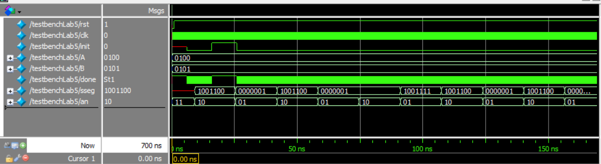

# lab05- Multiplicador

## Nombres de integrantes

### Diddier Alexander Hilarion Beltran
### Gabriela María Castro Beltrán
### Daniel Pineda

## Resumen

En el presente informe, se muestra la realización del diseño, sintentización e implementación de un multiplicador, el cual fue necesario un divisor de frecuencia para la visualización en el display de siete segmento con su respectivo multiplexor de binario a BCD, registro de desplazamiento y un desarrollo de toda la estructura de funcionamiento como una maquina de estados, la cual explicaremos acontinuación. Este laboratorio se efectuó através de Quartus, una herramienta de software producida por Altera para el análisis y la síntesis de diseños realizados en HDL o hardware description lenguage por sus siglas en inglés.

## Palabras claves
Verilog, tablas de verdad, compuertas lógicas, bit, FPGA, BCD, memoria, dirreción, registro, multiplexor
# Introdución

## Registro de desplazamiento

Un registro es un circuito digital cuya función es el almacenamiento y movimiento de datos. Estos estan compuestos por un conjunto de flip-flops (memoria) y apartir del diagrama de estados se elije el movimiento. La diferencia básica entre un registro y un contador es que un registro no tiene una secuencia de estados específica. En general, un registro se utiliza únicamente
para almacenar y desplazar datos.


## Maquinas de estado

Una máquina de estado o circuito secuencial, es un circuito que combina un etapa de lógica combinacional y un sección de memoria (flip-flops). Este circuito necesitará una entrada de clock para su etapa de memoria, el reloj será el componente el cual nos diga el paso del estado actual al estado siguiente. 


## Multiplicador
## Análisis del código

A continuación de encontrara el código que cada módulo a utilizar, junto con su explicación.
### Módulo del multiplicador

```python
module mult(clk , rst , init , A , B, done, sseg, an);
  
  input rst;
  input clk;
  input init;
  input [3:0]A;
  input [3:0]B;
  output done;
  output [0:6] sseg;
  output [1:0] an;
  
  wire w_sh;
  wire w_reset;
  wire w_add;
  wire w_z;
  
  wire [7:0]w_A;
  wire [3:0] w_B;
  
  wire [4:0] bcd;
  wire [1:0] an;
  wire [7:0] pp;

  wire [26:0] cf;
  wire enable;
  assign enable = cf[15];


	counter_clk(.clk(clk), .rst(rst), .cfreq(cf));
	BCDtoSSeg bcdsseg(.BCD(bcd), .SSeg(sseg));
	 
	dynamic_v dv(.rst(rst), .clk_e(enable), .pp(pp), .an(an), .bcd(bcd) );


	rsr rsr0 (.clk(clk), .in_B(B) , .shift(w_sh) , .load(w_reset) , .s_B(w_B));
	lsr lsr0 (.clk(clk), .in_A(A) , .shift(w_sh) , .load(w_reset) , .s_A(w_A));
	comp comp0(.B(w_B), .z(w_z));
	acc acc0 (.clk(clk), .A(w_A) , .add(w_add), .reset(w_reset), .pp(pp));
	control_mult control0 (.clk(clk), .rst(rst) , .lsb_B(w_B[0]) , .init( ~init) , .z(w_z) , .done(~done) , .sh(w_sh) , .reset(w_reset) , .add(w_add) );

endmodule
```
### Divisor de frecuencia
```python
`timescale 1ns / 1ps
module counter_clk(input clk, input rst, output reg [26:0] cfreq);

always @(posedge clk) begin//cuenta los ciclos de reloj
  if(rst == 0) begin
		cfreq <= 0;
	end else begin
		cfreq <=cfreq+1;
	end
end

endmodule
```

### Módulo BCDtoSSeg
```python

module BCDtoSSeg (BCD, SSeg);

  input [3:0] BCD;
  output reg [6:0] SSeg;
always @ ( * ) begin
  case (BCD)
   4'b0000: SSeg = 7'b0000001; // "0"  
	4'b0001: SSeg = 7'b1001111; // "1" 
	4'b0010: SSeg = 7'b0010010; // "2" 
	4'b0011: SSeg = 7'b0000110; // "3" 
	4'b0100: SSeg = 7'b1001100; // "4" 
	4'b0101: SSeg = 7'b0100100; // "5" 
	4'b0110: SSeg = 7'b0100000; // "6" 
	4'b0111: SSeg = 7'b0001111; // "7" 
	4'b1000: SSeg = 7'b0000000; // "8"  
	4'b1001: SSeg = 7'b0000100; // "9" 
   4'ha: SSeg = 7'b0001000;  
   4'hb: SSeg = 7'b1100000;
   4'hc: SSeg = 7'b0110001;
   4'hd: SSeg = 7'b1000010;
   4'he: SSeg = 7'b0110000;
   4'hf: SSeg = 7'b0111000;
    default:
    SSeg = 0;
  endcase
end

endmodule
```

### Módulo dynamic

```python

module dynamic_v(input rst,
 input clk_e, input [7:0] pp, output reg [1:0] an,
 output reg [3:0] bcd);

reg count =0;
always @(posedge clk_e or negedge rst) begin
		if(rst == 0) begin
			count<= 0;
			an<=2'b11; 
		end else begin 
			count<= count+1;
			//an<=2'b10; 
			case (count) 
				1'h0: begin bcd <= pp[3:0];   an<= 2'b10; end 
				1'h1: begin bcd <= pp[7:4];   an<= 2'b01; end
			endcase
		end
end

endmodule
```

### Módulo rsr
Este modulo hace un desplazamiento hacia la derecha sobre un número, esto es equivalente a hacer división entera por dos.
```python
module rsr (clk, in_B , shift , load , s_B);
  input clk;
  input [3:0]in_B;
  input load;
  input shift;
  output reg [3:0]s_B;

always @(negedge clk)
  if(load)
     s_B = in_B ;
  else
   begin
    if(shift) s_B = s_B >> 1;
    else s_B = s_B;
   end

endmodule
```

### Módulo lsr
Este modulo hace un desplazamiento hacia la izquierda sobre un número, esto es equivalente a multiplicar por dos.
```python
module lsr (clk , in_A , shift , load , s_A);
  input clk;
  input [3:0]in_A;
  input load;
  input shift;
  output reg [7:0]s_A;

always @(negedge clk)
  if(load)
     s_A = in_A ;
  else
   begin
    if(shift) s_A = s_A << 1 ;
    else  s_A = s_A;
   end

endmodule
```
### Módulo comp
Este modulo verifica que el multiplicando sea cero es decir que se haya llegado al final de la multiplicación.
```python
module comp(B, z);
  input [3:0]B;
  output z;
  reg tmp;
  
  initial tmp = 0;
  assign z = tmp;

    always@(*)
      tmp = (B==0) ? 1'b1 : 1'b0;

endmodule
```

### Módulo acc
Este modulo realiza las sumas parciales cuando la máquina de estado finito está en el estado ADD
```python
module acc (clk , A, add, reset, pp);
  input clk;
  input [7:0] A;
  input add;
  input reset; 
  output reg [7:0] pp;

initial pp = 0;

always @(negedge clk)
  if (reset == 1) 
   pp = 8'h00;
  else
     begin
      if (add) pp = pp + A;
      else pp = pp;
     end
endmodule
```

### Módulo control de multiplicador
Este modulo contiene la máquina de estados finitos que controla nuestro multiplicador, posee dos always uno para cambio de estados y el segundo para mantener actualizadas las variables de estado.
```python
module control_mult( clk , rst , lsb_B , init , z , done , sh , reset , add );

 input clk;
 input rst;
 input lsb_B;
 input init; 
 input z;

 output reg done;
 output reg sh;
 output reg reset;
 output reg add;

 parameter START  = 3'b000;
 parameter CHECK  = 3'b001;
 parameter SHIFT  = 3'b010;
 parameter ADD  = 3'b011;
 parameter END  = 3'b100;
 
 reg [2:0] state;
 
 initial begin
  done = 0;
  sh = 0;
  reset = 0;
  add = 0;
  state = 0;
 end
 
reg [3:0] count;

always @(posedge clk) begin
    if (rst == 0) begin
      state = START;
    end else begin
    case(state)

     START:begin
		count=0;
        if(init)
          state = CHECK;
        else
          state = START;
     end

     CHECK:
      if(lsb_B)
        state = ADD;
      else
        state = SHIFT;
        
     ADD: state = SHIFT;
     
     SHIFT: 
      if(z)
        state = END;
      else
        state = CHECK;

     END:begin
		state = (init == 0) ? END : START ; // hace falta de 10 ciclos de reloj, para que lea el done y luego cargue el resultado
     end

     default: state = START;
     
   endcase
   end
 end


always @(posedge clk) begin
  case(state)
    START:begin
        done = 0;
        sh = 0;
        reset = 1;
        add = 0;
       end
     CHECK:begin
        done = 0;
        sh = 0;
        reset = 0;
        add = 0;
       end
     SHIFT:begin
        done = 0;
        sh = 1;
        reset = 0;
        add = 0;
       end
     ADD:begin
        done = 0;
        sh = 0;
        reset = 0;
        add = 1;
       end
     END:begin
        done = 1;
        sh = 0;
        reset = 0;
        add = 0;
       end
     default:begin
        done = 0;
        sh = 0;
        reset = 0;
        add = 0;
       end
  endcase
end

endmodule

```
## Simulación

Para la simulación se uso el archivo testbenchLab5.v de los cuales se obtuvo el siguiente resultado 



Con esta simulación vemos como el mutiplicador cumple su funcion cuando esta activo el init, se da la visualización dinámica. 

## Vídeo de funcionamiento
En el siguiente video se observa la visualización dinámica en los display de 7 segmentos de un multiplicador de 4 bits, los datos son leidos de los dip switch de la placa.

[](https://www.youtube.com/watch?v=mE-fohrMjX4 "visualización")
## Conclusión

Comprender el funcionamiento de la máquina de estados a partir de sus diferentes diagramas tanto de flujo como estructural, es una herramienta importante al momento de implementar esto en una descripción de Hardware. La máquina de estados es una de las bases fundamentales para los sistemas digitales, por lo que es indispensable su entendimiento

## Bibliografía
1.	Floyd. Fundamentos de Sistemas Digitales 9 Edicion. Pearson Educacion; 2007.
